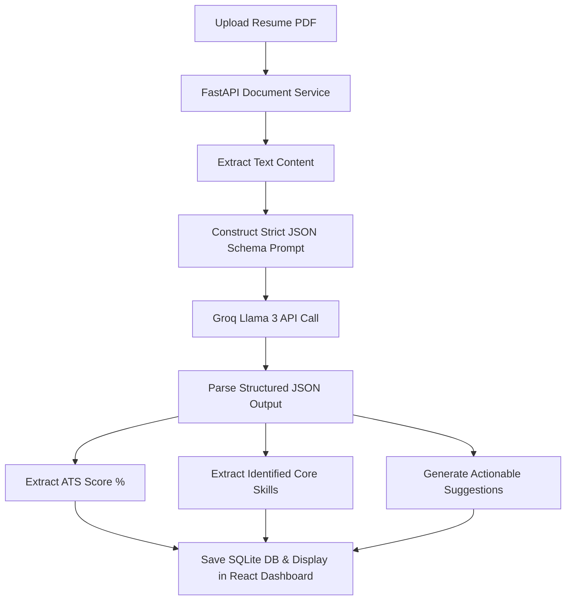
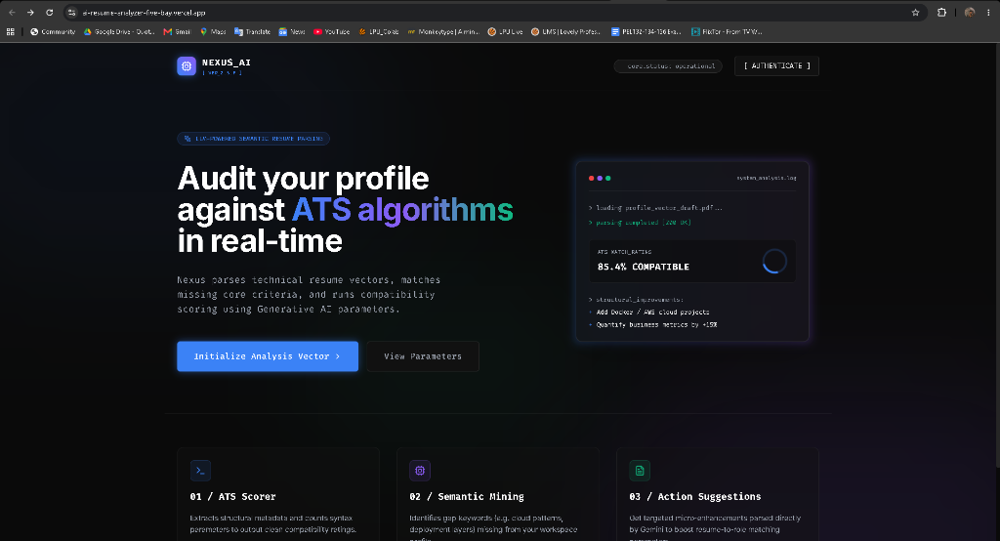
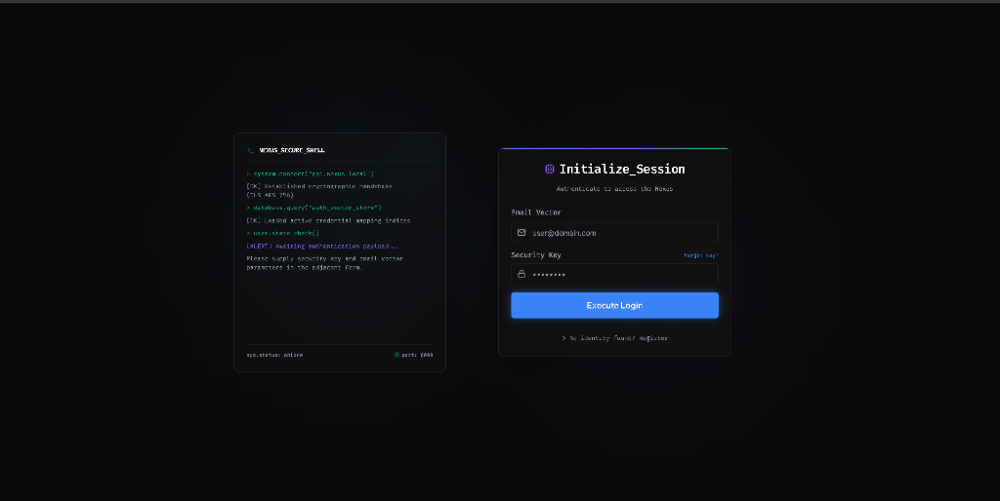
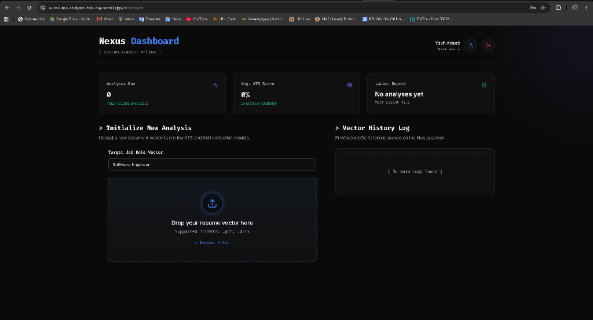
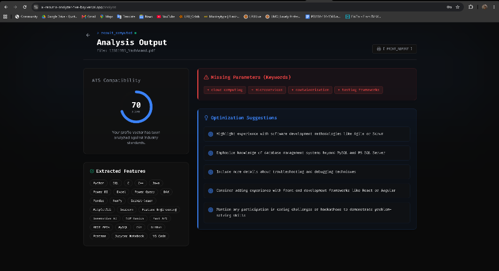

# 🌌 Nexus AI - Resume Analyzer

[](https://fastapi.tiangolo.com)
[](https://react.dev)
[](https://www.typescriptlang.org)
[](https://tailwindcss.com)
[](https://groq.com/)
[](https://sqlite.org)

Nexus AI is a premium, full-stack AI-powered application that evaluates resume PDFs against ATS compatibility metrics, analyzes technical skill coverage, and renders Generative AI feedback suggestions using Groq Llama 3 LLM and Python NLP integrations.

---

## 🚀 Features

- **Semantic ATS Scorer**: Renders technical compatibility indices and matches syntax parameters.
- **Skill Extraction Model**: Highlights missing keywords (e.g. cloud patterns, container layers, deployment matrices).
- **Intelligent Improvements**: Generates targeted micro-enhancements parsed directly by Gemini to boost matching odds.
- **Secure Identity Core (JWT)**: Fully isolated registration, authentication, and secure profile management.
- **Password Settings Console**: Allows active users to change passwords from their profile settings panel.
- **One-Time Password (OTP) Recovery**: Email-backed password reset flow using secure 6-digit numeric codes with automated database validation.
- **Visual Log History**: Interactive history tracking that maintains parsed resume scores, date stamps, and analysis logs.
- **Modern Glassmorphic UI**: Vibrant cyberpunk dark mode with clean typography, Framer Motion animations, and responsive panels.

---

## 🧠 AI Analysis Pipeline

Nexus AI connects document processing with Large Language Model inference:



---

## 🔌 API Endpoints Reference

### **Authentication Core (`/api/v1/auth`)**
| HTTP Method | Route | Payload Schema | Auth Required | Description |
|:---:|---|---|:---:|---|
| `POST` | `/signup` | `UserCreate` | No | Register a new user identity vector |
| `POST` | `/login` | `OAuth2PasswordRequestForm` | No | Authenticate and obtain JWT access token |
| `GET` | `/me` | None | Yes | Get currently active user metadata parameters |
| `POST` | `/change-password` | `ChangePasswordRequest` | Yes | Securely update security key credentials |
| `POST` | `/forgot-password` | `ForgotPasswordRequest` | No | Issue a 6-digit numeric recovery OTP |
| `POST` | `/verify-otp` | `VerifyOTPRequest` | No | Validate OTP key and reset credentials |

### **Resume Analysis Core (`/api/v1/resumes`)**
| HTTP Method | Route | Payload Schema | Auth Required | Description |
|:---:|---|---|:---:|---|
| `POST` | `/` | `Multipart/Form-Data` + `job_role` | Yes | Upload and parse new PDF vector via Groq Llama 3 |
| `GET` | `/` | None | Yes | Query list logs of all historical parsed records |
| `GET` | `/{resume_id}` | None | Yes | Inspect specific resume ATS suggestions & parameters |
| `DELETE` | `/{resume_id}` | None | Yes | Purge a resume record from database storage |

---

## 🛠️ Tech Stack

### **Frontend**
- **React (Vite)** + **TypeScript**
- **Tailwind CSS** (Styling System)
- **Framer Motion** (Transitions & Micro-animations)
- **Zustand** (Global State Orchestration)
- **Lucide React** (Cyberpunk Icons library)

### **Backend**
- **FastAPI** (High performance Python Web Framework)
- **SQLAlchemy** (SQL Database Toolkit & ORM)
- **SQLite** (Embedded transactional file database)
- **PyJWT** (Secure Session Cryptographic Tokens)
- **bcrypt** (Salted Password Hashing module)

### **AI Integration**
- **Groq Cloud API** (Llama 3 inference engine)
- **NLP / Prompt Engineering** (Strict JSON Output constraints)

---

## 📂 Directory Structure

```bash
├── backend/
│   ├── api/             # API Router endpoints (auth, resumes, deps)
│   ├── core/            # Configuration and security modules
│   ├── db/              # Database connection and session setup
│   ├── models/          # SQL database models (User, Resume, OTP)
│   ├── schemas/         # Pydantic schemas for request validation
│   ├── services/        # Service modules (Gemini integration, resume parser)
│   ├── main.py          # FastAPI application entrypoint
│   └── requirements.txt # Python dependency file
├── frontend/
│   ├── src/
│   │   ├── components/  # Reusable UI controls and file upload zones
│   │   ├── pages/       # Dashboard, Auth, and Analysis screens
│   │   ├── services/    # Axios HTTP endpoints (authService, resumeService)
│   │   ├── store/       # Zustand auth and resume state managers
│   │   ├── App.tsx      # Routing and initial authentication hook
│   │   └── main.tsx     # React application mounting
│   ├── package.json     # Node scripts and UI dependencies
│   └── tailwind.config.js
└── README.md
```

---

## ⚙️ Prerequisites

- **Node.js** (v18+)
- **Python** (v3.10+)
- **Groq API Key** (Accessible from Groq Console)

---

## 🚀 Local Installation & Setup

### 1️⃣ Backend Setup

1. Open a terminal and navigate to the backend directory:
   ```bash
   cd backend
   ```

2. Initialize and activate a virtual environment:
   ```bash
   # Windows
   python -m venv venv
   venv\Scripts\activate

   # macOS / Linux
   python3 -m venv venv
   source venv/bin/activate
   ```

3. Install dependencies:
   ```bash
   pip install -r requirements.txt
   ```

4. Create a `.env` file in the `backend/` directory:
   ```env
    GROQ_API_KEY=your_groq_api_key_here
    SECRET_KEY=generate_a_secure_jwt_secret_here
   
   # Optional SMTP credentials for email OTP dispatch (falls back to console stdout logs if left blank)
   SMTP_HOST=
   SMTP_PORT=587
   SMTP_USER=
   SMTP_PASSWORD=
   SMTP_FROM=
   ```

5. Start the FastAPI development server:
   ```bash
   uvicorn main:app --reload
   ```
   *The server runs locally at: `http://localhost:8000` (docs available at `/docs`)*

---

### 2️⃣ Frontend Setup

1. Open a new terminal and navigate to the frontend directory:
   ```bash
   cd frontend
   ```

2. Install dependencies:
   ```bash
   npm install
   ```

3. Run the Vite development server:
   ```bash
   npm run dev
   ```
   *The web app runs locally at: `http://localhost:5173`*

---

## 📦 Deployment

### **Frontend**
- **Hosting URL**: [https://ai-resume-analyzer-five-bay.vercel.app/](https://ai-resume-analyzer-five-bay.vercel.app/)

### **Backend**
- **API URL**: [https://ai-resume-analyzer-backend-i4ac.onrender.com/docs](https://ai-resume-analyzer-backend-i4ac.onrender.com/docs)

---

## 📸 Application Screenshots

#### **1. Landing Page Console**


#### **2. Authentication Gate**


#### **3. Dashboard Overview**


#### **4. ATS Score & Generative Feedback Panel**


---

## 👨‍💻 Author

**Yash Anand**